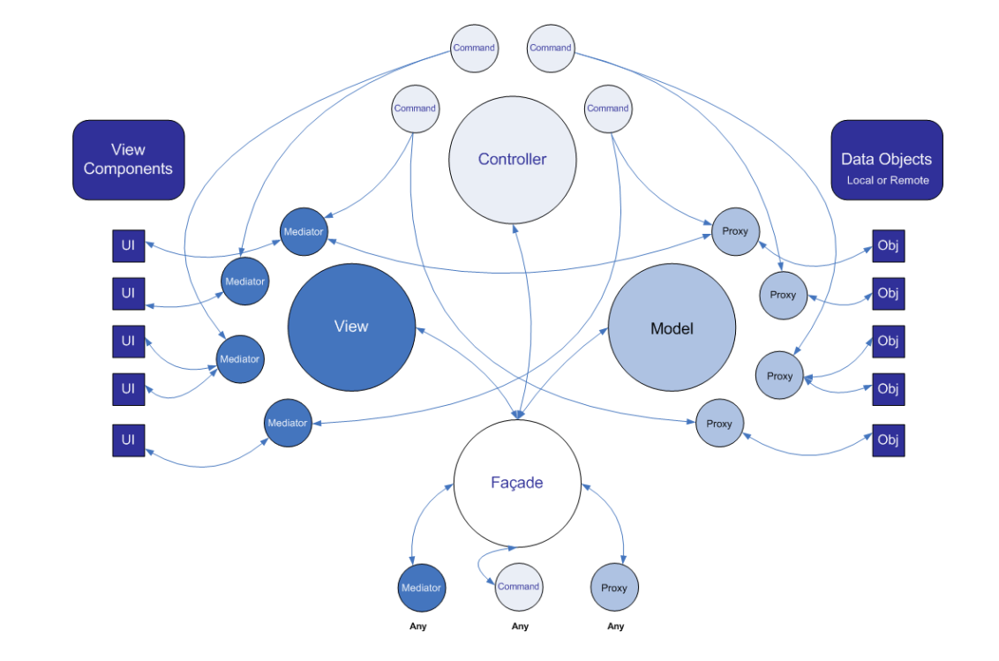

# Model-View-Controller implement by Design Pattern



[PureMVC](https://puremvc.org/) 是 MVC 框架的開放式軟體，其架構設計概念是以 Design Pattern 來實踐 MVC 框架；在早期如 Flash、JavaScript、C++ 皆沒有使用者介面框架，僅提供文件元素控制、繪圖控制器的呈現架構中，套用此框架是個適當的選擇；然而，在 C#、Android、iOS，乃至 Unity、Unreal、React 的軟體工具發展中，可以發現 MVC 架構已成為一個最基本的互動架構，並被引用到這些開發工具中。

然而，即使開發工具整併了其自身的 MVC 框架，但然會有不夠充分的架構細節，而且多數是偏重在 View 的建構，並常以 SPA ( Single-Page Applicaton ) 來考量；因此，當軟體規模擴大，發展至 MPA ( Multi-Page Application )、大量動態呈現、資料即時運算時，僅使用開發工具內建的 MVC 工具就有諸多缺乏。

因此，在實務的軟體的架構設計上，依據其對應語言的互動框架缺失，並由 PureMVC 的設計概念補足是較適當的方式；但需注意，使用 PureMVC 補足的應是該框架仍缺乏且可實踐的部分，並對原生框架建立相容的轉換物件，不可因為複雜而直接棄用。

## Model-View-Controller application

+ Singleton Pattern
+ Facade Pattern

```
Application app = Application.getInstance();
app.Initial(new Views(), new Controllers(), new Models());
```
> MVC 應用程式的初始化範本

MVC 應用程式，是一個典型的 Singleton 與 Facade 樣式的應用物件；藉由 Singleton 產生的唯一化物件，其目的是讓物件其生命週期與應用程式相等，並確保不論何時皆可取回唯一的應用程式進入點；而 Facade 則是為了修正唯一化物件應減少直接公開的全域函數、變數，讓實際的操作、命令用 Facade 樣式封裝。

```
Application.getInstance().models().retrieve("model-name");
```
> 採用 Facade 封裝命令接口，已達成宣告式程式設計。

原則上共會有四個物件需要使用到 Facade，並以此提供必要的容器控制介面與相應的模組的必要操作。

+ Application
+ Views
+ Models
+ Controllers

## Model

+ Proxy Pattern
+ Adapter Pattern
+ Service & Callback Framework

```
Proxy model = Application.getInstance().models().retrieve("model-name");
```

模組 ( Model ) 主要採用 Proxy 設計樣式，其設計目的是透過代理者操作介面來引含模組內部操作的諸多行為，而在實務運用上可以將 Proxy 分為幾類：

+ Data proxy
資料代理者，是實際儲存、擷取資料的資料物件，對應不同介面應會進行相關的資料處理、格式轉換。

+ Remote proxy
遠端服務代理者，是用於非同步取得遠端資料物件，這類物件若不是主動發出訊息取回資料，則應被動聽取遠端回應；在實務上設計 Service & Callback 框架就是一種將存取與溝通規範封裝的設計方式。

```
View view = Application.getInstance().views().retrieve("view-name");
model.observe("vairable", view.action);
```
> 設定 Model 監聽變數的變更，若變更則應該呼叫 View 對應行為。

模組一旦更新完畢，應立即呼叫對應的視圖進行更新，在這操作上本身有兩個路線：

+ View -> Controller --> Model --> View
在這路線上，是透過 View 的互動觸發命令執行，而命令執行則會在呼叫模組進行動作，當完畢後更新介面

+ Remote Proxy -> View
在這路線上，是一個被動偵聽遠端資料的代理者聽到訊息並改變模組資料，這時應對等更新介面

在實務上，路線一是最常出現的設計，路線二則是典型的 Socket 行為；但有一點需注意，在諸多新架構或開發工具中，路線一的設計會被簡化為反應式程式設計 ( Reactive Programming )，這對於簡易的訊息檢測互動或介面動態是適當的，但反之則容易破壞 Proxy 封裝資料操作的行為，將大量的數據處理、管理轉至 視圖內而導致維護難度增高。

## View

+ Mediator Pattern
    - View Component
+ Observer Pattern
    - Reactive Programming

```
View view = Application.getInstance().views().retrieve("view-name");
```

視圖 ( View ) 主要採用 Mediator 與 Observer 設計樣式，Mediator 用於呈現資料層與互動設定，Observer 用於互動事件偵聽；在諸多新架構或開發工具中，這兩個樣設設計是最常由框架實踐完畢的物件，例如 XNA、React.js 的 View 元件就是將其兩者合併進去的物件；然而，在實務上這兩者並非完全無用，而是視情況必須設計與應用

```
Class ViewA {
    ViewA() {
    		this.mediator = Application.getInstance().views().retrieve("view-name");
    }
   	run() {
    		this.mediator.notify("Update-body-info");
    }
}
Class ViewB {
    ViewB() {
    		this.mediator = Application.getInstance().views().retrieve("view-name");
    }
    work() {
    		this.mediator.notify("Update-body-info");
    }
}
```
> Mediator 可以用於共通行為觸發應用

Mediator 設計概念類同 Proxy，因此同屬於行為模式 ( Behavioral pattern )，但其差異在 Proxy 重視隱含操作，Mediator 則是互動、代轉操作，因此若相似功能介面、背景主體等設計，則可透過這設計來作圍；此外，在 MVP ( Model-View-Presenter ) 架構，Mediator 亦相似 Presenter，將互動的行為與資料快取在物件內，將遠端、複雜資料處理轉給 Proxy 處理。

但實務上，這樣的設計目的是將視圖的元件 ( View Component ) 在分為三類，用 Mediator 封裝 Model、Controller，將互動的行為與資料，和呈現再次分離，而這樣的設計對等於不同互動框架則如下所列：

+ MVP ( Model-View-Presenter ) 中的 Presenter
+ PAC ( Presentation–abstraction–control ) 中的 Abstraction、Control
+ DV ( Document-View ) 中的 Document
+ MVVM ( Model-View-ViewModel ) 中的 ViewModel

```
Class ViewA {
	ViewA() {
    		this.mediator = Application.getInstance().views().retrieve("view-name");
            this.mediator.register(new Notification("Update-body-info", this.showInfo));
    }
   	run() {
    		this.mediator.notify("Update-body-info");
    }
}
```

Observer 設計概念的實踐就是典型的事件系統 ( Event System )，無論是 JavaScript 的 Event-Listener，或 Java 的 Observable 都是基於此設計樣式，在不同程式語言、互動框架，這系統幾乎都會提供；這系統最主要是透過登記 Subject，並在 Subject 下註冊多個 Notification，則當 Subject 透過 Key 觸發執行時，註冊在 Notification 內對應函數都會被相應執行 ( 在沒有 function pointer 概念的語言則會用物件替代為執行對象 )。

雖然不同語言與框架多會提供，甚至完整的事件系統、反應式程式設計皆會包含這些行為，但需注意在框架本身會指定可註冊的 Subject，若今天需要的全域、區域廣播、自建事件、簡化操作框架，則設計相應的 Observer 是有其必要性。

## Controller

+ Command Pattern
    - Progress Framework

```
Controller con = Application.getInstance().controllers().retrieve("controller-name");
```

控制器 ( Controller ) 主要採用 Command 設計樣式，此設計著重在如何將處理流程模組化，以提高再用率與組合性；而其延伸框架則是用於動態建構非同步流程的 Progress，這框架概念源自應用程式轉場時會碰到的諸多狀態改變、動畫呈現，在基於命令模式設計後，並引入 Dataflow 架構為基礎來規劃而成。

若從 MVC 於 Pattern-Oriented Software Architecture 的範例來看 Controller，在看近期 MVC 架構的 Controller，可以發現不論是何種 MVC 架構、延伸架構，對於 Controller 的解釋會因時制宜的改變；演進至反應式程式設計時，甚至會有 Controller 流程固定化或移除的設計，例如 Document-View。

但就個人觀察，Controller 的簡化有兩個成因：

+ 網際網路應用程式，使流程處理與資料儲存轉移至伺服器
+ 簡約風格與互動設計優先，使介面單一化且侷限單頁內互動

上述過程是併行發生的事項，在電腦的發展從個人電腦、網際網路、雲端運算逐一崛起後，資料運算、儲存就逐漸從本地電腦轉移到雲端系統上；而電腦雖然逐漸空出運算空間，但介面的複雜性提高也相對用掉空出的空間，不過近年的設計風格與介面也走向簡約風的情況下，實際也降低了在介面端需要複雜控制器的必要。

但是，依據實際產品的必要性，有兩個主要用途仍需要使用複雜的控制器：

+ 超過數個頁面或元件、數個資料模組同時階段運作的工作流程
+ 應用程式介面轉場與動畫呈現

相關 Progress 設計原則參考 [Dataflow Architecture](https://github.com/eastmoon/dataflow-architecture) 的設計原則